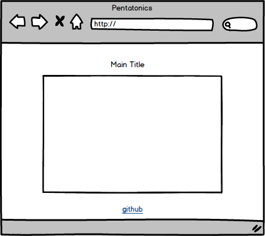

## Soundwaves

### Background  

Soundwaves, inspired by Audiotool's [Tonematrix](http://www.tonematrix.audiotool.com), is a way to make music by pressing buttons. It is a 16x16 musical step sequencer that uses the pentatonic scale, one of humanity's most [fascinatingly widespread](https://www.youtube.com/watch?v=ne6tB2KiZuk) musical constructs.

### Functionality & MVP  

Users will be able to:

- [ ] Create a pattern to be played
- [ ] Play and pause the current patern
- [ ] Clear the current sound pattern
- [ ] Generate a random pattern

In addition, this project will include:

- [ ] An About modal describing the background and rules of the game
- [ ] A production README

### Wireframes

This app will consist of a single screen with game board, and nav links to the Github, my LinkedIn,
and the About modal.  

### Architecture and Technologies

This project will be implemented with the following technologies:

- Vanilla JavaScript and `jquery` for overall structure and game logic
- `Easel.js` with `HTML5 Canvas` for DOM manipulation and rendering
- `HTML5 WebAudioKit API` for audio manipulation
- Webpack to bundle and serve up the various scripts

In addition to the webpack entry file, there will be four scripts involved in this project:

`grid.js`: handle the logic for creating and updating the necessary `Easel.js` elements and rendering them to the DOM.

`sequencer.js`: handle behind-the-scenes logic of actually playing the user-generated pattern.

`audio.js`: handle interfacing with `HTML5 WebAudioKit API`.

`square.js`: house the constructor and update functions for the `Square` objects.  Each `Square` will contain a `playing` boolean, a `note` that it plays, a `position` coordinate, and a `time` (what time it should play, relative to the beginning of the measure)

### Implementation Timeline

**Day 1**

Setting up the files structure. Writing the rendering logic.

**Day 2**

Setting up live url. Learning how to interface with `HTML5 WebAudioKit API`.

**Day 3**

Writing the sequencer logic

**Day 4**

Making random patterns. Styling the board, transitions, and effects.

### Bonus features

There are many directions this sequencer could go.  Some anticipated updates are:

- [ ] Ability to add drums
- [ ] Share their musical creation
- [ ] Controls for delay, tempo, cutoff, resonance, reverb, release, and attack
- [ ] Background visualizer
